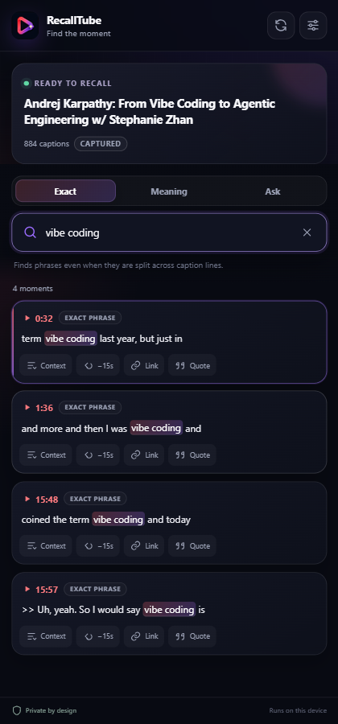
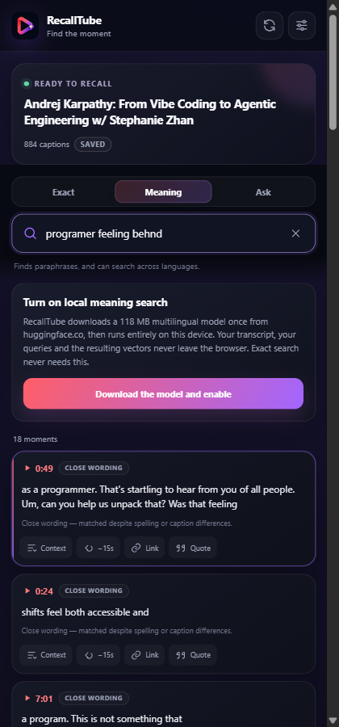
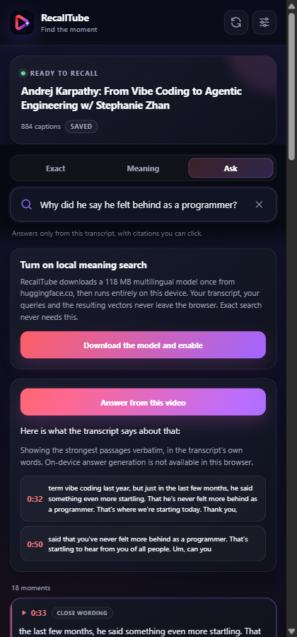

<p align="center">
  
</p>

<h1 align="center">RecallTube</h1>

<p align="center">
  Find the exact moment you remember in a YouTube video—even when you remember the meaning, not the words.
</p>

<p align="center">
  Local-first · No account · No server · No telemetry · Apache-2.0
</p>

RecallTube is an open-source Chrome and Edge extension that searches the transcript of the YouTube
video you are watching and jumps directly to the matching timestamp. Exact search runs instantly;
optional semantic search runs on-device with a multilingual embedding model.

## Three ways to find the moment

These screens come from the complete 884-caption transcript of
[Andrej Karpathy: From Vibe Coding to Agentic Engineering](https://www.youtube.com/watch?v=96jN2OCOfLs).
They are generated by the packaged extension during the reference-video browser test—not hand-made
mockups.

### Search — the words you remember

Literal matches stay fast, preserve the original caption text, and jump to the exact timestamp.

<p align="center">
  
</p>

### Meaning — the idea you remember

Typos and paraphrases still retrieve useful evidence; the optional multilingual model adds
cross-language semantic recall without uploading the transcript.

<p align="center">
  
</p>

### Ask — the answer with receipts

Answers stay grounded in the transcript and expose clickable timestamp citations instead of hiding
their evidence.

<p align="center">
  
</p>

## What makes it different

- **Exact** finds literal phrases, including matches split across multiple caption cues, and
  highlights the original text accurately across languages and Unicode variants.
- **Meaning** combines BM25, character n-grams and local multilingual embeddings, so paraphrases,
  misspellings and cross-language queries can find the right moment.
- **Ask** returns transcript-grounded answers with clickable timestamp citations. When Chrome's
  on-device Prompt API is unavailable, it falls back to extractive evidence rather than a remote AI.
- **Private by design** keeps transcripts, queries, embeddings and answers on the device.
- **Resilient caption acquisition** tries the player's caption track first, then temporarily uses
  YouTube's native transcript renderer. RecallTube closes only the panel it opened and preserves a
  panel the user already had open.

## Install from source

Requirements: Node.js 20+ and Chrome or Edge 116+.

```bash
git clone https://github.com/AbdelghaniKbt/recalltube.git
cd recalltube
npm ci
npm run build
```

Then:

1. Open `chrome://extensions` or `edge://extensions`.
2. Enable **Developer mode**.
3. Choose **Load unpacked**.
4. Select `.output/chrome-mv3`.
5. Reload YouTube tabs that were already open, then click the RecallTube toolbar icon.

## How caption acquisition works

```text
player caption track
        │
        ├─ available ───────────────► validate, fetch, parse
        │
        └─ empty or blocked ────────► open YouTube's native transcript
                                      capture rendered cues
                                      restore the previous panel state
                                                │
                                                ▼
                                      local transcript cache
```

This is an unofficial integration. RecallTube does not forge Proof-of-Origin tokens, bypass access
controls, download media streams or use a transcript proxy. If YouTube's own transcript renderer
cannot obtain captions for the active session, RecallTube reports that honestly.

## Retrieval quality

The checked-in benchmark contains 31 queries across four transcripts:

| Retrieval configuration | Recall@1 | Median timestamp error |
| --- | ---: | ---: |
| Exact only | 0.28 | 0 s |
| Local lexical retrieval | 0.76 | 0 s |
| Lexical + local multilingual model | **0.97** | **0 s** |

Cross-language Recall@1 improves from 0.29 to 1.00 when the model is enabled. This dataset is a
regression harness, not a claim of state of the art. See
[the benchmark methodology and raw results](docs/RETRIEVAL_BENCHMARK.md).

## Architecture

```text
YouTube page
   │
   ├─ main-world bridge: reads player caption metadata, no privileges or fetches
   │
   └─ isolated content script: validates, acquires, parses, cancels stale navigation
                                      │
                                      ▼
                              React side panel
                              exact + lexical search
                                      │
                                      ▼
                              dedicated AI worker
                              local embeddings only
```

The packaged extension contains no remotely hosted executable code. Meaning search downloads the
model weights only after explicit user consent; Exact search never downloads the model. The build
fails if an unexpected runtime host or a Node-only dependency appears in the Chrome artifact.

Read [the architecture](docs/ARCHITECTURE.md) for the full design and [SECURITY.md](SECURITY.md)
for its trust boundaries and residual risks.

## Development

```bash
npm ci
npm run typecheck       # strict TypeScript
npm test                # 177 unit, property and fuzz tests
npm run build           # Chrome MV3 build + artifact hardening
npm run test:e2e        # 13 packaged-extension browser tests
npm run bench           # retrieval-quality benchmark
npm run bench:perf      # per-keystroke performance benchmark
```

Additional live and reference-video checks are documented in [docs/TESTING.md](docs/TESTING.md).
Live YouTube tests are intentionally non-hermetic because caption availability is controlled by
YouTube and the active browser session.

## Privacy and security

- No transcript, query, embedding or answer upload.
- No account, analytics, telemetry, backend or third-party transcript API.
- Extension permissions are limited to `storage`, `sidePanel`, `tabs` and the declared runtime hosts.
- Page data and transcript text are treated as untrusted input.
- Caption URLs and cross-world messages are runtime-validated.

See [PRIVACY.md](PRIVACY.md) and [SECURITY.md](SECURITY.md). Please use GitHub's private
vulnerability-reporting feature for security issues.

## Limitations

- YouTube exposes no supported transcript API for arbitrary third-party videos; page changes can
  break acquisition.
- The native transcript panel can be momentarily visible during last-resort capture.
- Videos without captions, and sessions where YouTube's own transcript request fails, cannot be
  searched. RecallTube deliberately does not download audio or run speech recognition.
- Live streams and premieres may expose no stable transcript until they finish.
- Meaning search requires an approximately 118 MB one-time model download.
- Generative Ask answers require a compatible browser-provided on-device model; extractive answers
  remain available without it.
- Chrome and Edge are supported. Firefox has no equivalent `sidePanel` API yet.

## Contributing

Contributions are welcome. Read [CONTRIBUTING.md](CONTRIBUTING.md), run the required checks, and
include benchmark evidence for retrieval changes.

## Documentation

| Document | Purpose |
| --- | --- |
| [Architecture](docs/ARCHITECTURE.md) | Components, boundaries and retrieval pipeline |
| [Testing](docs/TESTING.md) | Automated checks and live YouTube matrix |
| [Retrieval benchmark](docs/RETRIEVAL_BENCHMARK.md) | Methodology, metrics, raw results and limitations |

## License

Apache-2.0. See [LICENSE](LICENSE) and [NOTICE](NOTICE).
