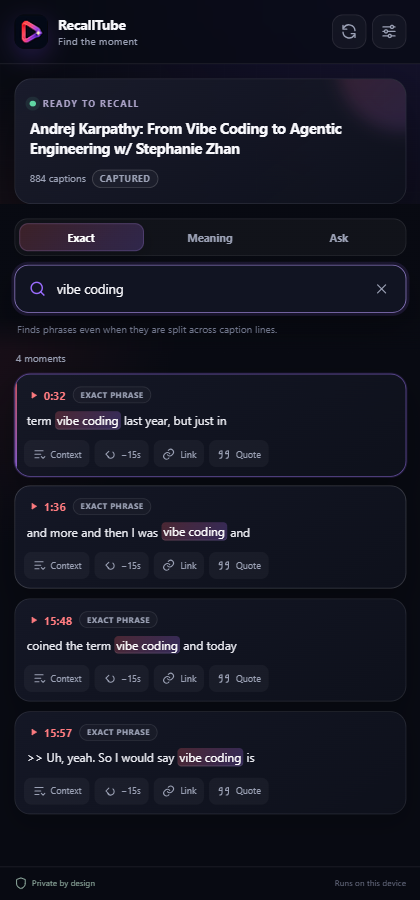
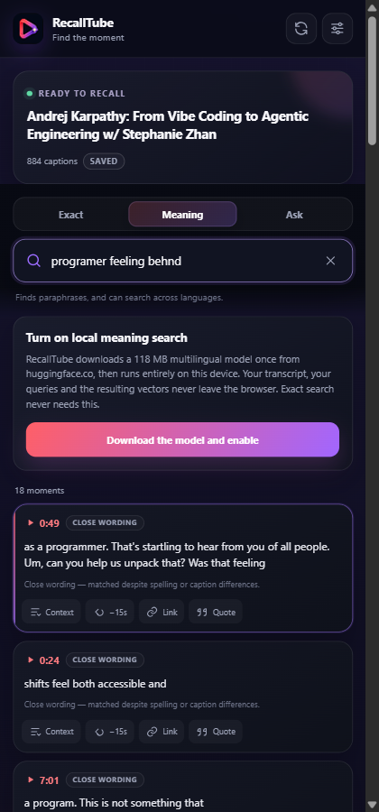
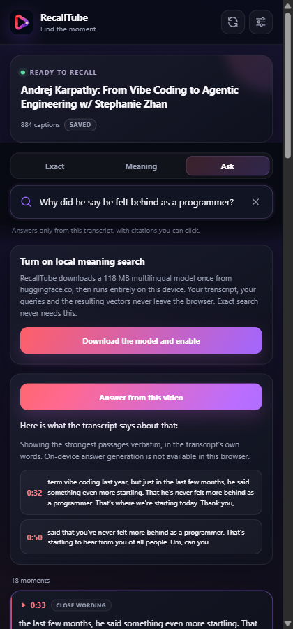

<p align="center">
  
</p>

<h1 align="center">RecallTube</h1>

<p align="center">
  Find the exact moment you remember in one YouTube video or across an entire playlist.
</p>

<p align="center">
  Local-first · No account · No server · No telemetry · Apache-2.0
</p>

RecallTube is an open-source Chrome and Edge extension that searches YouTube transcripts and jumps
directly to the matching timestamp. Search the current video instantly, or build a resumable local
index for every captioned video in a playlist. Exact search needs no model; optional semantic search
runs on-device with a multilingual embedding model.

## Three ways to find the moment

These screens come from the complete 884-caption transcript of
[Andrej Karpathy: From Vibe Coding to Agentic Engineering](https://www.youtube.com/watch?v=96jN2OCOfLs).
They are generated by the packaged extension during the reference-video browser test—not hand-made
mockups.

### Search — the words you remember

Literal matches stay fast, preserve the original caption text, and jump to the exact timestamp.

<p align="center">
  
</p>

### Meaning — the idea you remember

Typos and paraphrases still retrieve useful evidence; the optional multilingual model adds
cross-language semantic recall without uploading the transcript.

<p align="center">
  
</p>

### Ask — the answer with receipts

Answers stay grounded in the transcript and expose clickable timestamp citations instead of hiding
their evidence.

<p align="center">
  
</p>

## What makes it different

- **Exact** finds literal phrases, including matches split across multiple caption cues, and
  highlights the original text accurately across languages and Unicode variants.
- **Meaning** combines BM25, character n-grams and local multilingual embeddings, so paraphrases,
  misspellings and cross-language queries can find the right moment.
- **Ask** returns transcript-grounded answers with clickable timestamp citations. When Chrome's
  on-device Prompt API is unavailable, it falls back to extractive evidence rather than a remote AI.
- **Entire playlist** searches every indexed video from one query, preserves the source video and
  playlist position on every result, and opens the match in playlist context.
- **Resumable indexing** reuses cached transcripts, survives MV3 service-worker suspension, exposes
  pause/cancel/retry controls, and reports unavailable videos instead of hiding them.
- **Private by design** keeps transcripts, queries, embeddings and answers on the device.
- **Resilient caption acquisition** tries the player's caption track first, then temporarily uses
  YouTube's native transcript renderer. RecallTube closes only the panel it opened and preserves a
  panel the user already had open.

## Search an entire playlist — no API key

Open any YouTube playlist or a video inside one, open RecallTube, then choose **Entire playlist** and
**Index this playlist**. RecallTube reads the playlist inventory already delivered to the page and
processes one video at a time. No YouTube Data API key, OAuth flow, backend, transcript proxy, or
audio download is used.

For each missing video, RecallTube creates one muted, minimized extension-owned worker window, pauses
its playback, and first tries the same direct caption path used for a single video. If YouTube
withholds that body, the worker is shown as a small (720×540) window in the bottom-right corner of
your window, **without taking focus** — YouTube does not build its transcript control in a minimized
window, but it does in an unfocused one — while RecallTube opens YouTube's transcript, waits for
every row, captures them, and closes the panel and the worker. If your window manager hands focus
to the worker anyway, focus is returned to the window that had it. A video that YouTube's player
reports as removed, private or not yet started is marked unavailable at once and never shown. A
fresh worker is used for the next item so player and panel state cannot leak between videos.
Progress and partial search results remain available throughout.

## Install from source

Requirements: Node.js 20+ and Chrome or Edge 116+.

```bash
git clone https://github.com/AbdelghaniKbt/recalltube.git
cd recalltube
npm ci
npm run build
```

Then:

1. Open `chrome://extensions` or `edge://extensions`.
2. Enable **Developer mode**.
3. Choose **Load unpacked**.
4. Select `.output/chrome-mv3`.
5. Reload YouTube tabs that were already open, then click the RecallTube toolbar icon.

## How caption acquisition works

```text
player caption track
        │
        ├─ available ───────────────► validate, fetch, parse
        │
        └─ empty or blocked ────────► open YouTube's native transcript
                                      capture rendered cues
                                      restore the previous panel state
                                                │
                                                ▼
                                      local transcript cache
```

This is an unofficial integration. RecallTube does not forge Proof-of-Origin tokens, bypass access
controls, download media streams or use a transcript proxy. If YouTube's own transcript renderer
cannot obtain captions for the active session, RecallTube reports that honestly for that video and
continues the playlist.

## Retrieval quality

The checked-in benchmark contains 31 queries across four transcripts:

| Retrieval configuration | Recall@1 | Median timestamp error |
| --- | ---: | ---: |
| Exact only | 0.28 | 0 s |
| Local lexical retrieval | 0.76 | 0 s |
| Lexical + local multilingual model | **0.97** | **0 s** |

Cross-language Recall@1 improves from 0.29 to 1.00 when the model is enabled. This dataset is a
regression harness, not a claim of state of the art. See
[the benchmark methodology and raw results](docs/RETRIEVAL_BENCHMARK.md).

## Architecture

```text
YouTube page
   │
   ├─ main-world bridge: reads player caption metadata, no privileges or fetches
   │
   └─ isolated content script: validates, acquires, parses, cancels stale navigation
                                      │
                                      ▼
                              React side panel
                              exact + lexical search
                                      │
                                      ▼
                              dedicated AI worker
                              local embeddings only

Playlist inventory ──► MV3 coordinator ──► one muted worker at a time
                         resumable jobs         minimized: direct captions
                                                restored, unfocused: native transcript, then close
```

The packaged extension contains no remotely hosted executable code. Meaning search downloads the
model weights only after explicit user consent; Exact search never downloads the model. The build
fails if an unexpected runtime host or a Node-only dependency appears in the Chrome artifact.

Read [the architecture](docs/ARCHITECTURE.md) for the full design and [SECURITY.md](SECURITY.md)
for its trust boundaries and residual risks.

## Development

```bash
npm ci
npm run typecheck       # strict TypeScript
npm test                # 251 unit, property and fuzz tests
npm run build           # Chrome MV3 build + artifact hardening
npm run test:e2e        # 27 packaged-extension browser tests
npm run test:live:playlist -- "https://www.youtube.com/playlist?list=..." gradient
npm run bench           # retrieval-quality benchmark
npm run bench:perf      # per-keystroke performance benchmark
```

Additional live and reference-video checks are documented in [docs/TESTING.md](docs/TESTING.md).
Live YouTube tests are intentionally non-hermetic because caption availability is controlled by
YouTube and the active browser session.

## Privacy and security

- No transcript, query, embedding or answer upload.
- No account, analytics, telemetry, backend or third-party transcript API.
- Extension permissions are limited to `storage`, `sidePanel`, `tabs` and the declared runtime hosts.
- Page data and transcript text are treated as untrusted input.
- Caption URLs and cross-world messages are runtime-validated.

See [PRIVACY.md](PRIVACY.md) and [SECURITY.md](SECURITY.md). Please use GitHub's private
vulnerability-reporting feature for security issues.

## Limitations

- YouTube exposes no supported transcript API for arbitrary third-party videos; page changes can
  break acquisition.
- For the current video, the native transcript panel can be momentarily visible during last-resort
  capture. For a playlist item, that fallback shows its separate 720×540 worker window in the
  bottom-right corner of your window, unfocused, typically for 10–30 seconds per video and longer on
  a slow machine or connection, then closes it. YouTube does not render the transcript in a
  minimized or hidden window, so this cannot be made invisible.
- A long transcript takes as long as YouTube needs to deliver it. RecallTube waits while the capture
  is still advancing (up to a few minutes per video) rather than reading a partial list, and retries a
  failed video automatically up to three times before leaving it for **Retry failures**.
- Videos without captions, and sessions where YouTube's own transcript request fails, cannot be
  searched. RecallTube deliberately does not download audio or run speech recognition.
- Live streams and premieres may expose no stable transcript until they finish.
- Large playlists take time because RecallTube deliberately processes only one video at once.
- Meaning search requires an approximately 118 MB one-time model download and stores fewer cached
  embedding sets than exact-search transcripts.
- Generative Ask answers require a compatible browser-provided on-device model; extractive answers
  remain available without it.
- Chrome and Edge are supported. Firefox has no equivalent `sidePanel` API yet.

## Contributing

Contributions are welcome. Read [CONTRIBUTING.md](CONTRIBUTING.md), run the required checks, and
include benchmark evidence for retrieval changes.

## Documentation

| Document | Purpose |
| --- | --- |
| [Architecture](docs/ARCHITECTURE.md) | Components, boundaries and retrieval pipeline |
| [Testing](docs/TESTING.md) | Automated checks and live YouTube matrix |
| [Retrieval benchmark](docs/RETRIEVAL_BENCHMARK.md) | Methodology, metrics, raw results and limitations |

## License

Apache-2.0. See [LICENSE](LICENSE) and [NOTICE](NOTICE).
